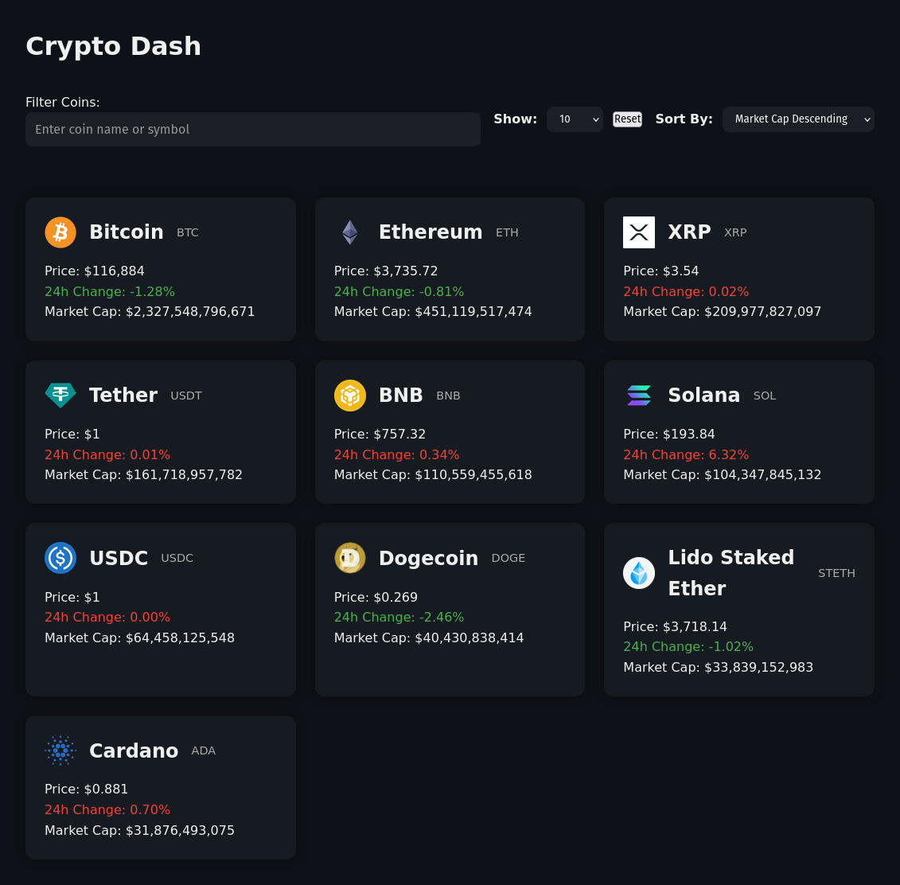

# crypto-dashboard
  
This is a simple Crypto Dashboard application. It allows users to filter and sort cryptocurrency data, demonstrates fetching data from an API, and utilizes environment variables for configuration.

